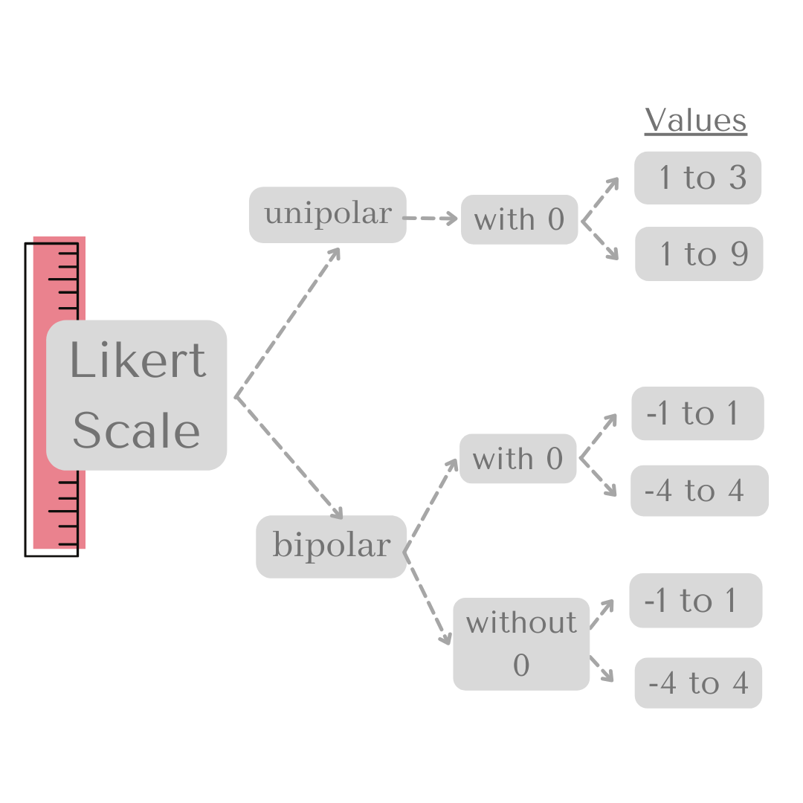
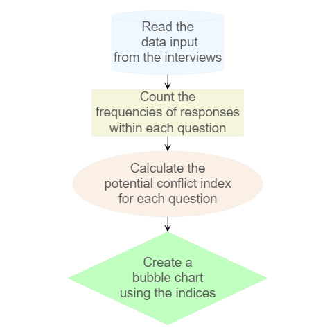

# pcir: Potential for Conflict Index in R <a href='https://fblpalmeira.github.io/pcir/'></a>

## Overview

`pcir` is an R package developed to assist researchers and practitioners
in calculating, comparing, and visualizing the Potential for Conflict
Index (PCI) among stakeholders. PCI is a descriptive statistical method
designed to enhance the understanding of outcomes in human dimensions
research [(Manfredo et
al. 2003;](https://www.tandfonline.com/doi/abs/10.1080/10871200304310)
[Vaske et
al. 2010)](https://www.tandfonline.com/doi/abs/10.1080/01490401003712648).

The concepts of consensus, disagreement, and conflict are relevant
across a wide range of disciplines, including economics, political
science, psychology, sociology, and natural resource management.
Although PCI can be calculated using software such as Excel, SPSS, and
SAS, no dedicated R package existed for this analysis — until now.

This package was developed as part of my training in the [rOpenSci
Champions Program](https://ropensci.org/champions/), supported by the
Chan Zuckerberg Initiative.

Additional information:

- [Introducing rOpenSci Champions - Cohort
  2023-2024](https://ropensci.org/blog/2024/02/15/champions-program-champions-2024/)

## Theoretical approach



**Figure 1.** Likert scales used in the Potential for Conflict Index
(PCI).

## Workflow

Steps implemented in the ‘pcir’ package:

1.  Read the input data from interviews – see example dataset
    [(Spreadsheet)]();

2.  Count the frequency of responses for each question – see [(Table
    1)]();

3.  Calculate the PCI for each question – see [(Table 2)]();

4.  Generate a bubble chart to visualize the results – see [(Figure)]().



**Figure 2.** Workflow of the `pcir` package.

## Features

- `counting()`: Summarizes data by calculating counts, percentages,
  means, and standard deviations.

- `pci()`: Computes the Potential for Conflict Index from summary data.

- `bubble()`: Visualizes PCI results using a bubble plot.

## Installation

Install the development version of `pcir` directly from GitHub:

``` r
# Uncomment the line below if devtools is not installed
# install.packages("devtools")

devtools::install_github("fblpalmeira/pcir")
```

## Usage

After installation, load the package:

``` r
library(pcir)
```

Example dataset:

``` r
df1 <- data.frame(
  A = c(-1, -1, -1, 0, -1),
  B = c(-1, 1, 0, -1, 1),
  C = c(1, 1, 1, 0, -1),
  D = c(0, -1, 1, 1, 1),
  E = c(1, 1, 0, -1, -1)
)
```

Count responses:

``` r
df2 <- counting(df1)
df2
```

Calculate PCI:

``` r
df3 <- pci(df2, negative_val = -1, positive_val = 1, scale_type = 'bipolar')
df3
```

Visualize with a bubble plot:

``` r
# The bubble function creates a bubble plot to visualize the PCI results.
# You can customize the colors and title as per your preferences.
plot <- bubble(df3,
               scale_type = 'bipolar',
               ylim_range = 1,
               bubble_color = 'lightblue',
               bubble_stroke = 'darkblue',
               title = 'Custom Bubble Colors')
plot
```


**Figure 3.** Bubble chart illustrating the Potential for Conflict
Indices.

## References

Manfredo, M., Vaske, J., Teel, T. (2003). [The potential for conflict
index: A graphic approach to practical significance of human dimensions
research](https://www.tandfonline.com/doi/abs/10.1080/10871200304310).
Human Dimensions of Wildlife, 8(3), 219-228.

Vaske, J. J., Beaman, J., Barreto, H., Shelby, L. B. (2010). [An
extension and further validation of the potential for conflict
index](https://www.tandfonline.com/doi/abs/10.1080/01490401003712648).
Leisure Sciences, 32(3), 240-254.

## Citation

If you use the `pcir` package in your work, please cite it as follows:

``` r
citation(package = 'pcir')
```

Example output:

``` r
To cite the 'pcir' package in publications, use:

  Palmeira F, Wundervald B (2025). _pcir: Potential for
  Conflict Index in R_. R package version 0.0.0.9000,
  <https://github.com/fblpalmeira/pcir>.

The BibTeX entry for LaTeX users is

  @Manual{,
    title = {pcir: Potential for Conflict Index in R},
    author = {Francesca Belem Lopes Palmeira and Bruna Wundervald},
    year = {2025},
    note = {R package version 0.0.0.9000},
    url = {https://github.com/fblpalmeira/pcir},
  }
```

## License

This package is licensed under the [MIT
License](https://github.com/fblpalmeira/pcir?tab=MIT-1-ov-file) file for
more details.

## Bug Reports

If you encounter any bugs or issues, please report them on the [GitHub
Issues](https://github.com/fblpalmeira/pcir/issues) page.

Note: To report a bug, you need a GitHub account, which you can join for
free.

## Discussions

The [Discussions
section](https://github.com/fblpalmeira/pcir/discussions) is the space
for the `pcir` community to ask questions, share ideas, or get help
without opening formal issues.

## Contact

For any questions or inquiries, please contact Francesca Palmeira at
<francesca@alumni.usp.br>.
