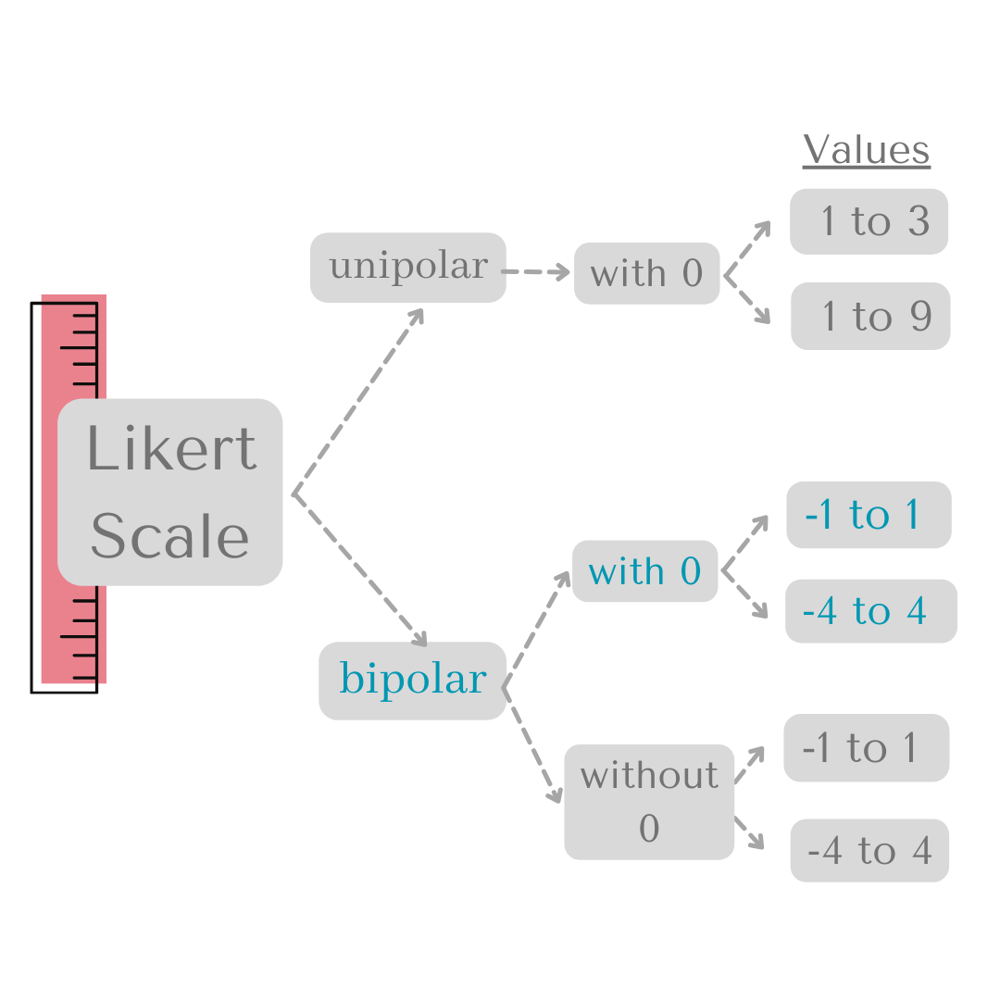
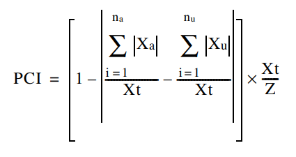

---
output:
  xaringan::moon_reader:
    css: ["rladies", "rladies-fonts"]
    lib_dir: libs
    nature:
      highlightStyle: github
      highlightLines: true
      countIncrementalSlides: false
---
```{r setup, include=FALSE}
options(htmltools.dir.version = FALSE)
knitr::opts_chunk$set(tidy = FALSE, eval = FALSE)
```
class: center, middle

background-image: url("pcir_logo.png")
background-position: 92% 2%
background-size: 12% 

#**rOpenSci Champions 2023-2024**
##**Second Cohort Meeting**
 

###Francesca Belem Lopes Palmeira 
####[francesca@alumni.usp.br](mailto:francesca@alumni.usp.br) 
#### September, 2024
---
class: left, middle

background-image: url("pcir_logo.png")
background-position: 92% 2%
background-size: 12% 

###**Motivation:**

Human and nature interactions are important for conservation biology. Opinion can diverge, which can cause problems for conservation management.

For evidence-based management, we need to measure conflict potential.

<center>
 
</center>
#### Figure 1. Leave bear alone? 
---
class: left, middle

background-image: url("pcir_logo.png")
background-position: 92% 2%
background-size: 12% 

###**Project progress:**
####**Overview**

The Potential for Conflict Index (PCI) is a descriptive statistical method used to enhance understanding of outcomes in human dimensions research first developed by [(Manfredo et al. 2003)](https://www.tandfonline.com/doi/abs/10.1080/10871200304310). 

The PCI can currently be computed using software such as Excel, SPSS, and SAS, there is no dedicated R package available for conducting this specific analysis.

[pcir](https://fblpalmeira.github.io/pcir/) will equip users with the tools required for calculating, comparing, and graphing the potential for conflict. The concepts of consensus and disagreement or conflict hold relevance across various fields, including economics, political science, psychology, sociology, and natural resources.

---
class: left, middle

background-image: url("pcir_logo.png")
background-position: 92% 2%
background-size: 12% 

###**Project progress:**
####**Principal challenges**

- Develop the statistical equations into R functions;

<center>
  
</center>
#### Figure 2. Likert scales? 
---
class: left, middle

background-image: url("pcir_logo.png")
background-position: 92% 2%
background-size: 12% 

###**Project progress:**
####**Principal challenges**

- Develop the statistical equations into R functions;

<center>

</center>
####Figure 3. Bubble graph illustranting the Potencial Conflict Indices.
---
class: left, middle

background-image: url("pcir_logo.png")
background-position: 92% 2%
background-size: 12% 

###**Project progress:**
####**Principal challenges**

- Transform the R functions in a package;

- Learn to work on the [GitHub page](https://fblpalmeira.github.io/pcir/) using the Git interface. 

---
class: left, middle

background-image: url("pcir_logo.png")
background-position: 92% 2%
background-size: 12% 

###**Outreach Plan:** 

- Translation projects of the R Community (rOpenSci) to Portuguese;

- Promote online events (RLadies) to instruct users on how the pcir package works;

- Offer in person events at conferences, workshops and others to promote the use of the package.

---
class: center, middle

###**Thank you all!** 
